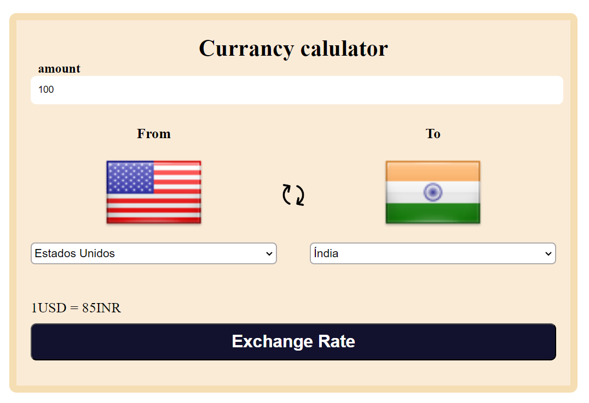

# 💱 Currency Converter

A simple and interactive currency converter web application built using **HTML**, **CSS**, and **JavaScript**. It allows users to convert one currency to another in real-time using live exchange rates.

---

## 🌐 Live Preview

[🔗 Click Here to View Live](https://your-live-demo-link.com)  
(Replace with your deployed GitHub Pages or Netlify link)

---

## 📸 Screenshots

---

## 🚀 Features

- Convert between multiple currencies instantly 💰
- Real-time exchange rates using an API 🌍
- Beautiful and responsive UI ✨
- Easy-to-use input system

---

## 🛠️ Technologies Used

- **HTML5**
- **CSS3**
- **JavaScript (Vanilla)**
- [Exchange Rate API](https://exchangerate-api.com/) or any other API

---

## 📂 Project Structure

